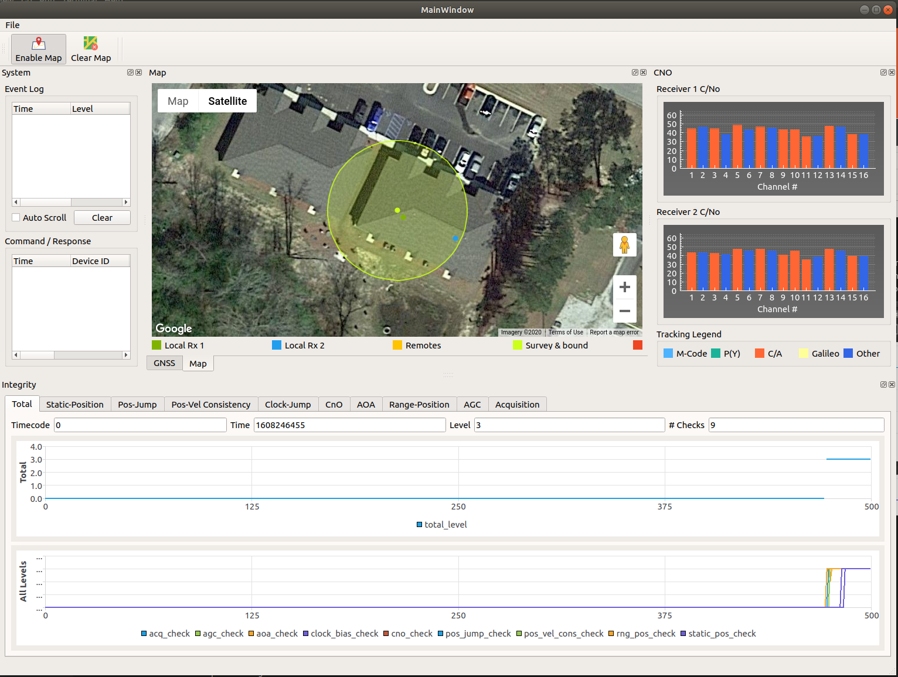
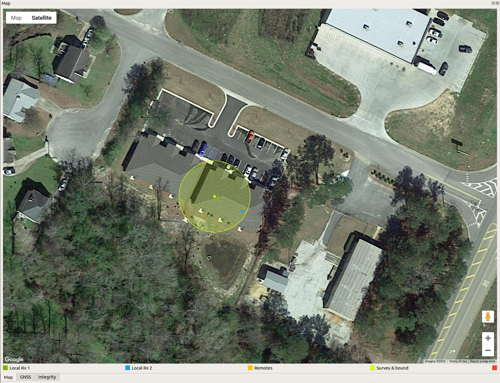
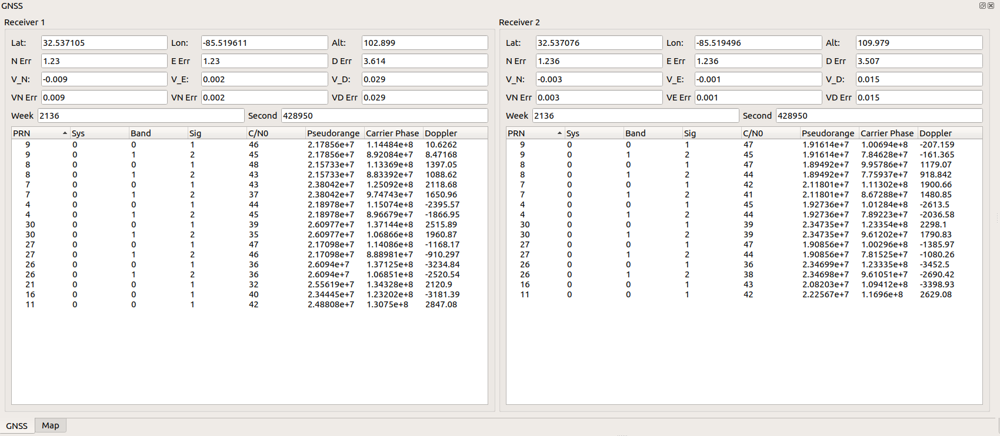
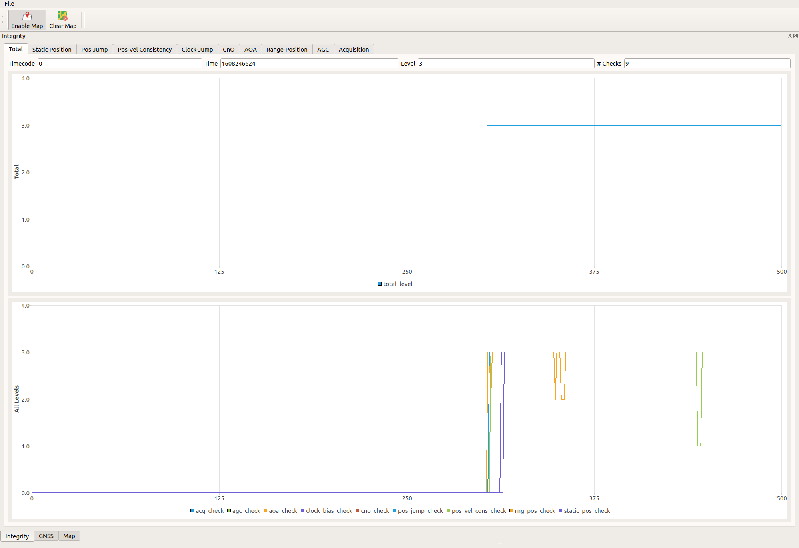

# PNT Integrity User Interface Application Guide

## Launching the Application
*Refer to the guide for the proper parent application for launching the UI*

The application window will display in the default configuration

@image latex doc/images/Default.png

## UI Components
The UI consists of several sub-windows that can be docked or un-docked depending 
on user preference. Each window and the content it displays is discussed in the
following sections

### Map Window
The map window contains an interactive google map widget. It displays the
track history of both local receivers, as well as the track histories of any
connected remote receivers / nodes (future capability). It also shows the
surveyed position and bound from the static position check. The final piece of
information displayed in the map plot are the location of identified threats
from the threat-location check.

@image latex doc/images/map.png

### GNSS Window
The GNSS Window shows PVT, channel status, and observable data from both local receivers

@image latex doc/images/GNSS.png

### CNO Window
The CNo window shows the carrier-to-noise ratio for each tracked PRN for both
receivers. The CNo level bars are color-coded for different signal-types and
constellations.

@image latex doc/images/CNo.png

### Integrity Window
The integrity window contains charts for the total assurance level from the
integrity monitor application, as well as levels for each configured assurance
check. Additional diagnostic information for each check is contained on separate
tabs. Information on how to interpret the diagnostic information can be found
in the integrity monitor application user guide.

@image latex doc/images/Integrity.png
